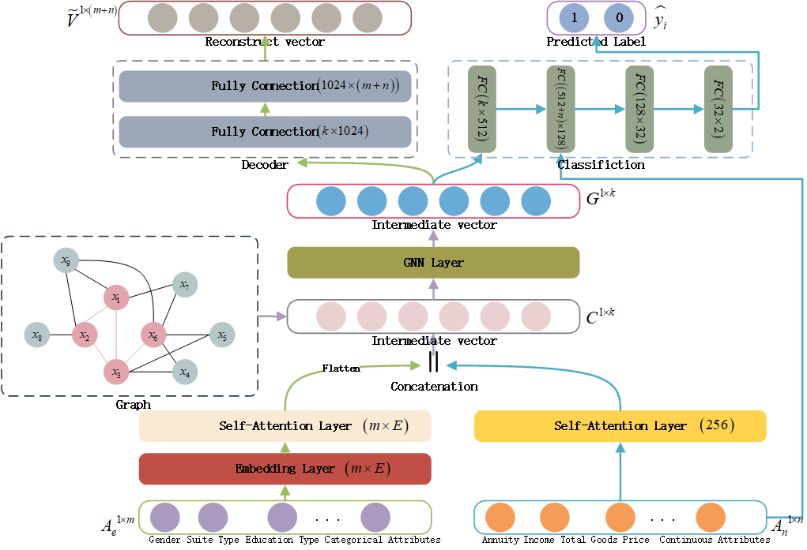

# SAGNN-for-Credit-Risk-Prediction

## Paper data and code

This is the code for the PAKDD 2022 Paper. [Self-attention Graph Neural Network with Multi-task Learning for Credit RiskPrediction](). We have implemented our methods in **Pytorch**.



Here are two datasets we used in our paper. After downloading the datasets, you can put them in the folder `data/:`

- [Home Credit Default Risk](https://www.kaggle.com/c/home-credit-default-risk/data)
- [Lending Club](https://www.kaggle.com/wordsforthewise/lending-club?select=accepted_2007_to_2018Q4.csv.gz)

There is a small dataset `sample/lending_club_sample.csv` included in the folder `data/`, which can be used to test the correctness of the code.

## Usage

You can run the file `SAGNN_lending_club.py` to train the model.

For example: `python SAGNN_lending_club.py --sample=True`

You can also change other parameters according to the usage:

```
usage: SAGNN_lending_club.py [-h] [--path PATH] [--sample SAMPLE] [--cluster_theta CLUSTER_THETA]
                             [--valid_portion VALID_PORTION] [--optimizer OPTIMIZER] [--epoch EPOCH]
                             [--step_size STEP_SIZE] [--EmbeddingSize EMBEDDINGSIZE] [--lr LR] [--l2 L2]
                             [--batchSize BATCHSIZE] [--lambda_ LAMBDA_] [--alpha_ ALPHA_] [--beta_ BETA_]
                             [--early_stop_epoch EARLY_STOP_EPOCH]
                             [--intermediate_vector_save INTERMEDIATE_VECTOR_SAVE]

optional arguments:
  -h, --help            show this help message and exit
  --path PATH           the folder to save the training and test raw data
  --sample SAMPLE       whether to use sample data
  --cluster_theta CLUSTER_THETA
                        the parameter to control graph construction
  --valid_portion VALID_PORTION
                        the portion of training data
  --optimizer OPTIMIZER
                        optimizer for training
  --epoch EPOCH         the number of epochs to train for
  --step_size STEP_SIZE
                        the interval epoch to decay learning rate
  --EmbeddingSize EMBEDDINGSIZE
                        Embedding size for enumerated variable
  --lr LR               learning rate
  --l2 L2               learning rate decay rate
  --batchSize BATCHSIZE
                        input batch size
  --lambda_ LAMBDA_     the parameter for multitasks learning (classification)
  --alpha_ ALPHA_       the parameter for multitasks learning (input reconstruction)
  --beta_ BETA_         the parameter for multitasks learning (cosine similarity between positive and negative
                        intermediate features)
  --early_stop_epoch EARLY_STOP_EPOCH
                        the parameter to control the early stop epochs
  --intermediate_vector_save INTERMEDIATE_VECTOR_SAVE
                        whether to save the intermediate vector
```

## Requiremetns

- Python 3.6
- Pytorch 1.1.0

All the dependent packages can be found on `requirements.txt`, you can use pip wheel to install these packages: `pip install -r requirements.txt -v`

## Citation

Please cite our paper if you use the code:


## License

MIT
